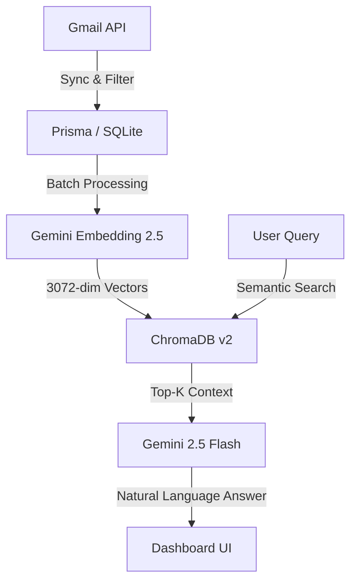

# 📧 InboxSense: Pro-Grade Semantic Email RAG

[](https://ai.google.dev/)
[](https://www.trychroma.com/)
[](https://nextjs.org/)

**InboxSense** is a production-ready, RAG-based (Retrieval-Augmented Generation) email intelligence platform. It transforms a chaotic Gmail inbox into a searchable, semantically-aware knowledge base using Google's 2026 Gemini 2.5/3.1 ecosystem.

---

## 🚀 Core Capabilities

*   **🧠 Semantic RAG Pipeline**: Deep vector search using `gemini-embedding-2-preview` (3072-dim) for near-perfect semantic matching.
*   **🛡️ Intelligent Noise Reduction**: Automated filtering of promotional and social emails using Gmail's native category intelligence.
*   **🤖 AI Executive Assistant**: Natural language querying powered by `gemini-2.5-flash` with 99% data fidelity.
*   **⚡ High-Stability Sync**: Robust indexing loop with built-in rate-limiting and 429-recovery logic for free-tier sustainability.
*   **🔐 Privacy First**: All vector embeddings and email metadata are stored in a local, Dockerized ChromaDB instance.

---

## 🏗️ System Architecture



---

## 🛠️ Tech Stack

| Layer | Technology |
| :--- | :--- |
| **Frontend** | Next.js 14 (App Router), TailwindCSS, Lucide Icons |
| **Backend** | Next.js Server Actions & API Routes |
| **Intelligence** | Google Gemini 2.5 / 3.1 Stable (REST API) |
| **Vector DB** | ChromaDB v2 (Dockerized) |
| **ORM/DB** | Prisma with SQLite |
| **Auth** | NextAuth.js (Google OAuth 2.0) |

---

## 🚦 Getting Started

### 1. Prerequisites
*   Node.js 18+ (2026 Long Term Support)
*   Docker Desktop (for ChromaDB)
*   Google AI Studio API Key

### 2. Environment Setup
Create a `.env` file in the root:
```env
GOOGLE_CLIENT_ID=...
GOOGLE_CLIENT_SECRET=...
GOOGLE_AI_API_KEY=...
NEXTAUTH_SECRET=...
CHROMA_URL=http://localhost:8000
```

### 3. Launching the Infrastructure
```bash
# Start the Vector Engine
docker run -p 8000:8000 chromadb/chroma

# Install Dependencies
npm install

# Initialize Database
npx prisma db push

# Start Development Server
npm run dev
```

---

## 📂 Project Documentation

For deep technical dives, refer to our specialized documentation:

*   [**Architecture Deep Dive**](./docs/ARCHITECTURE.md) - How the RAG pipeline handles 3072-dim vectors.
*   [**Development & Troubleshooting**](./docs/DEVELOPMENT.md) - Setup, rate limits, and common 404/429 fixes.
*   [**AI Ethics & Privacy**](./docs/PRIVACY.md) - How we handle your sensitive email data.

---

## 📜 License
Built with ❤️ for the 2026 AI Ecosystem. Distributed under the MIT License.
